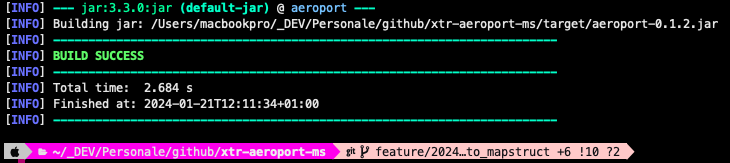

<a name="readme-top"></a>

<div align="center">
  
</div>

# xtr-aeroport-common-lib

Libreria condivisa della suite `xtr-aeroport-*`: raccoglie modelli, utility e componenti comuni riusati dai microservizi.

## Info sul progetto

Questo progetto nasce come piattaforma sperimentale personale per mettere alla prova tecnologie e framework moderni in un contesto realistico. Fornisce una base condivisa e "enterprise like" per i moduli della suite, seguendo le best practice così da essere un buon punto di partenza per sviluppi futuri.

È uno dei moduli di una serie più ampia, pensata per essere condivisa e arricchita con il contributo della community.

Fa parte della suite `xtr-aeroport-*`:

- `xtr-aeroport-ms` — microservizio di accesso ai dati
- `xtr-aeroport-batch` — import massivo dati
- `xtr-aeroport-typological` — dati tipologici
- `xtr-aeroport-common-lib` — libreria condivisa (questo modulo)

## Stack tecnologico

- Java 17
- Spring Boot 3.2.1
- Maven
- Linux, macOS, Windows

## Getting Started

Il progetto usa Maven per la gestione delle dipendenze e la compilazione. È sviluppato con Spring Boot 3 e Java 17.

### Prerequisiti

- Git (>= 2.43)
- Java OJDK (GraalVM versione 17)
- Maven (Apache Maven >= 3.9.6)

### Coordinate del progetto

| Proprietà | Valore |
|---|---|
| artifactId | `aeroport-common-lib` |
| version | `1.0.0` |

### Clonare e compilare

1. Clona il repository:
   ```bash
   git clone https://github.com/XtremeAlex/xtr-aeroport-common-lib.git
   cd xtr-aeroport-common-lib
   ```

2. Compila e installa la libreria nel repository Maven locale:
   ```bash
   mvn clean install
   ```
   

## Come contribuire

I contributi sono ciò che rende la community open source un posto straordinario per imparare e creare. Ogni contributo è molto apprezzato.

1. Fai un fork del progetto
2. Crea il tuo feature branch (`git checkout -b feature/nome-feature`)
3. Fai commit delle modifiche (`git commit -m "Aggiunge nome-feature"`)
4. Fai push sul branch (`git push origin feature/nome-feature`)
5. Apri una Pull Request

Se hai un suggerimento, apri pure una issue con il tag appropriato. E non dimenticare di mettere una stella al progetto!

## License

Distribuito sotto licenza Apache 2.0. Vedi il file [`LICENSE`](LICENSE) per i dettagli.

## Contatti

Andrei Alexandru Dabija — [LinkedIn](https://www.linkedin.com/in/andrei-alexandru-dabija/) — [github.com/XtremeAlex](https://github.com/XtremeAlex)
